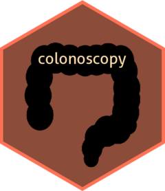

<!-- README.md is generated from README.Rmd. Please edit that file -->

```{r, include = FALSE}
knitr::opts_chunk$set(
  collapse = TRUE,
  comment = "#>",
  fig.path = "man/figures/README-",
  out.width = "100%"
)
```

# colonoscopy 

<!-- badges: start -->
[](https://codecov.io/gh/TylerGrantSmith/colonoscopy?branch=master)
[](https://www.tidyverse.org/lifecycle/#experimental)
[](https://github.com/TylerGrantSmith/colonoscopy/actions)
<!-- badges: end -->

`colonoscopy` provides functions and RStudio addins to easily add or remove explicit package scoping (`::`, `:::`)

## Installation

``` r
# install.packages("devtools")
devtools::install_github("TylerGrantSmith/colonoscopy")
```
## Example

`scope` will modify expressions or functions by appending explicit package references.
```{r unscope_example}
library(colonoscopy)
library(ggplot2)
scope("aes")
aes
scope(aes)
scope(aes, inPackage = FALSE)
```
`unscope` will modify expressions or functions by removing `::` and `:::` operators (and the package name).

```{r unpack_function_example}
unscope("ggplot2::alpha")
alpha
unscope(alpha)
```
